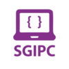

<div align="center">



# SGIPC Portfolio
**A Modern, Responsive, and Lightweight University Competitive Programming Club Portfolio**

[](#)
[](#)
[](#)
<br>
[](#)
[](#)
[](#)

</div>

> **SGIPC** (Special Group Interested in Programming Contest) is the official competitive programming club of KUET. This platform serves as a modern portfolio showcasing statistics, achievements, activities, and resources, while providing an administrative dashboard to manage content and receive contact inquiries.

---

## 🚀 Features

- **Premium Responsive Layout:** Fully optimized for all device sizes featuring a clean dark/light theme toggle.
- **Dynamic Metrics & Milestones:** Key statistics and club achievements are served dynamically from the MSSQL database.
- **Contact Channel:** An interactive contact form that stores user messages securely for review.
- **Admin Dashboard:** Secure dashboard allowing administrators to CRUD (Create, Read, Update, Delete) snapshots/achievements and manage incoming contact messages.
- **Modern Typography & Styling:** Rich design aesthetics with custom fonts, glassmorphism elements, and smooth transitions without relying on heavy CSS frameworks.

---

## 🛠️ Technology Stack

- **Backend Logic:** C# / ASP.NET Web Forms (.NET Framework 4.8)
- **Database Architecture:** Microsoft SQL Server (LocalDB) via `System.Data.SqlClient`
- **Frontend Presentation:** HTML5, Custom Vanilla CSS3, ES6 JavaScript

---

## 📂 Project Structure

```text
club_portfolio_project/
├── App_Code/
│   └── PortfolioRepository.cs        # Data access layer for DB operations
├── DatabaseScripts/
│   └── CreatePortfolioTables.sql     # SQL script to initialize DB and seed data
├── Admin.aspx                        # Admin dashboard UI
├── Admin.aspx.cs                     # Admin dashboard code-behind
├── Default.aspx                      # Main landing page UI
├── Default.aspx.cs                   # Main landing page code-behind
├── Login.aspx                        # Admin login UI
├── Login.aspx.cs                     # Admin login code-behind
├── Web.config                        # Application and database configuration
├── script.js                         # Frontend interactions and theme toggling
├── styles.css                        # Core styling system
└── logo.png                          # Club logo asset
```

---

## ⚙️ Setup & Installation

Follow these steps to get a development environment running.

### 1. Database Setup

Ensure your local SQL Server instance is running and execute the database script to set up the schema and seed initial data. Open Command Prompt or PowerShell in the root directory and run:

```bash
sqlcmd -S "(localdb)\MSSQLLocalDB" -i "DatabaseScripts\CreatePortfolioTables.sql"
```

The script will automatically:
- Create the `sgipcdb` database.
- Construct the `Snapshot`, `Achievements`, and `ContactMessages` tables.
- Seed the tables with initial metrics and achievements.

### 2. Connection & Credentials

Configure the application via the `Web.config` file:

- **Database Connection String:**
  By default, it is configured to use the LocalDB instance:
  ```xml
  <connectionStrings>
    <add name="PortfolioDb" connectionString="Data Source=(localdb)\MSSQLLocalDB;Initial Catalog=sgipcdb;Integrated Security=True" providerName="System.Data.SqlClient"/>
  </connectionStrings>
  ```
- **Administrative Credentials:**
  These are used to log in to the `/Login.aspx` portal.
  - **Username:** `admin`
  - **Password:** `admin123`

### 3. Run the Application

1. Open `club_portfolio_project.sln` using **Visual Studio 2022** (or your preferred IDE supporting ASP.NET Web Forms).
2. Ensure **IIS Express** is selected as the launch profile.
3. Run the project (Press `F5` or `Ctrl+F5`).
4. The browser should automatically open `http://localhost:<port>/Default.aspx`.
